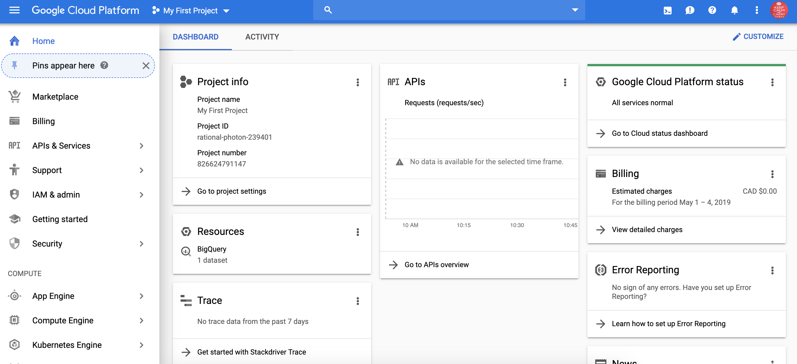
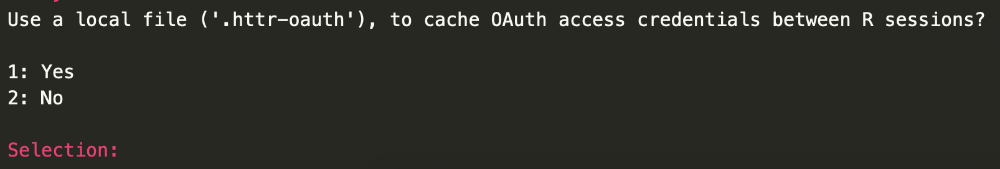
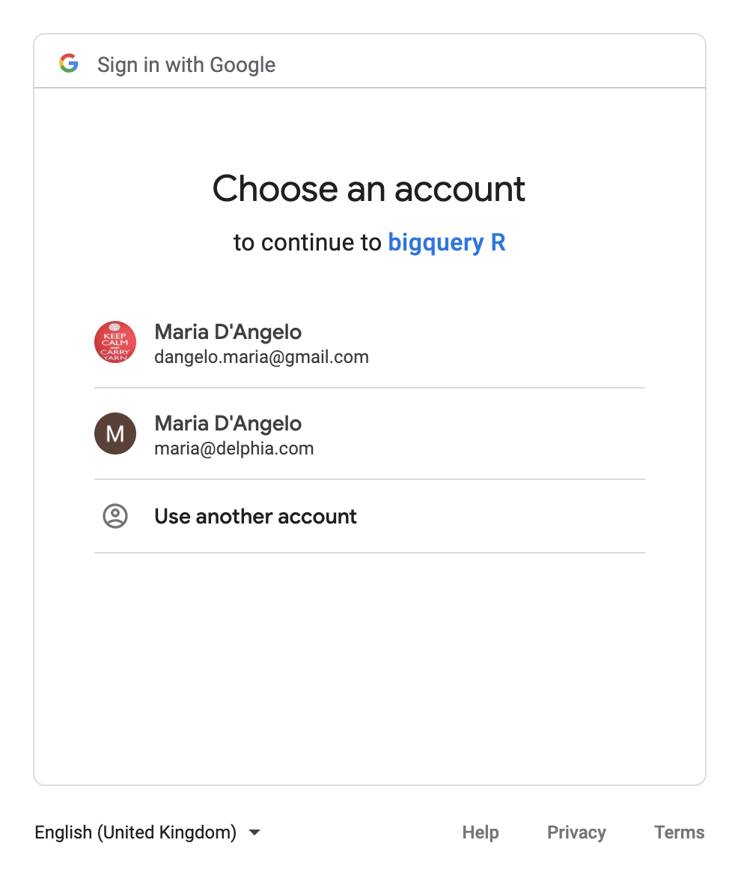
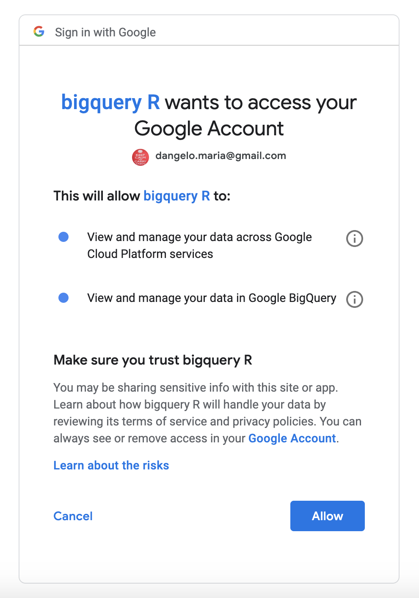
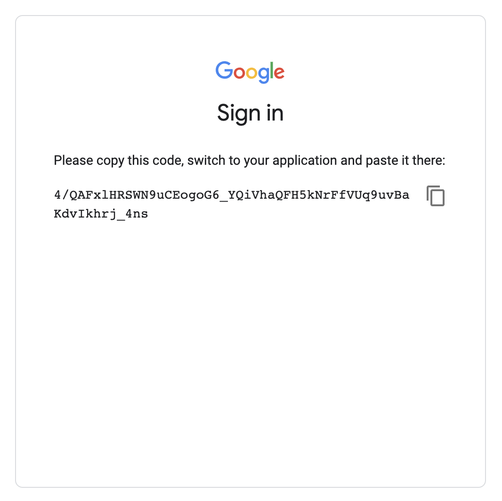
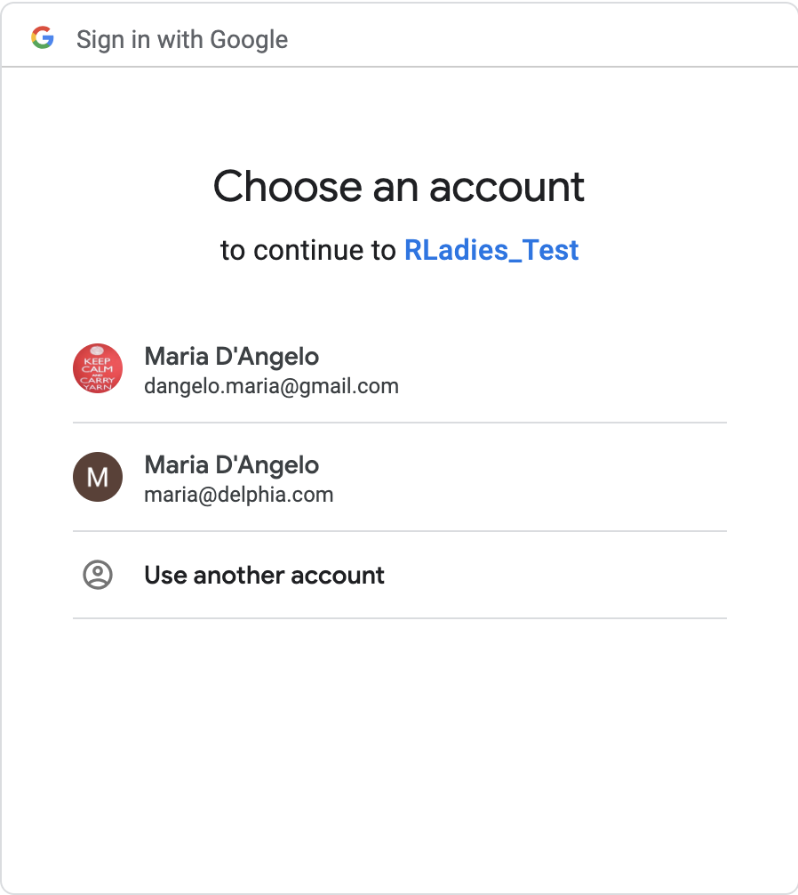
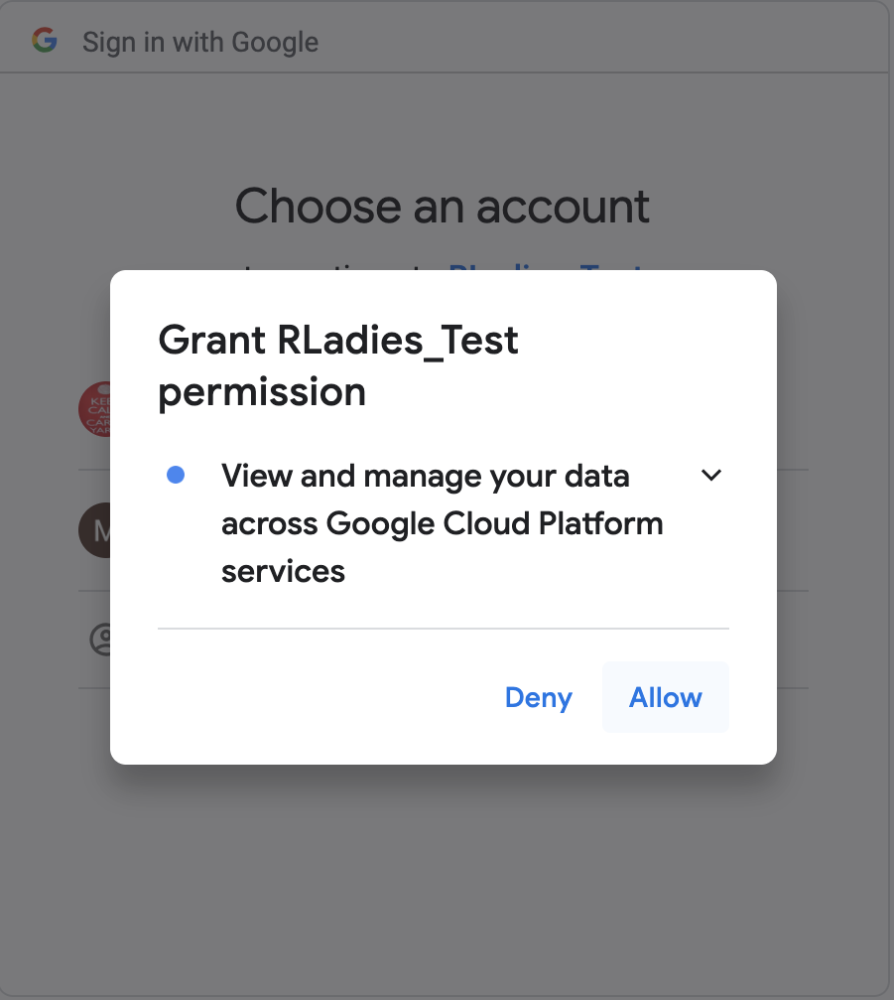
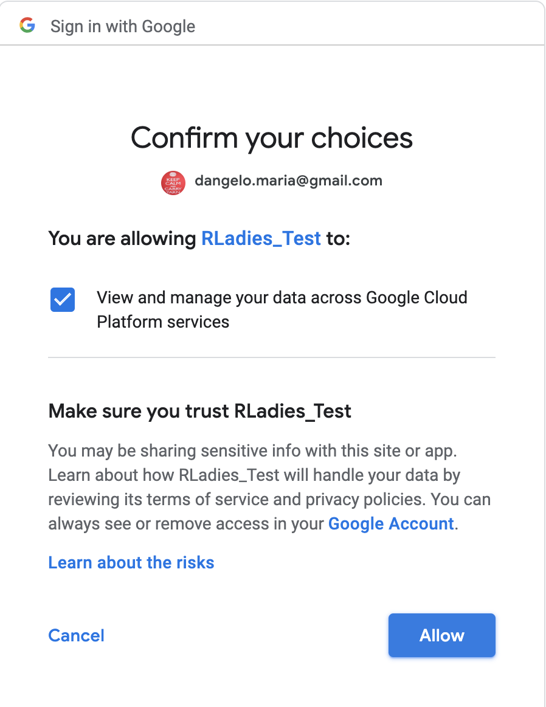

```{r setup, include=FALSE}
knitr::opts_chunk$set(echo = TRUE)
library(emo)
```


## Google Cloud Platform

{ width=90% }

## Google Cloud Platform {.build}

Today I'll be focusing two parts of Google Cloud Platform that I've used to access data: Google Cloud Storage and BigQuery   

#### Google Cloud Storage  
- Online file storage service for storing and accessing data on Google Cloud Platform
- Can be accessed from R using the `googleCloudStorageR` package

#### BigQuery  
- Set of tables that enables interactive analysis of massively large datasets working in conjunction with Google Storage
- Can be accessed from R using the `bigrquery` package
 

## Google Cloud Storage {.build}

{ width=90% }

<br> 

{ width=90% }


## Google Cloud Storage {.build}

### Important terms

#### Project
- Organizes all your Google Cloud Platform resources.  
- Name is shown at the top of the window (e.g. "My First Project" in the previous slide).
- If you click on the project name, you'll see the corresponding `project ID` (used later in the presentation).

#### Bucket  
- Similar to a folder or directory in your file system
- Can be nested

#### Object
- A file (e.g. `.csv`, `.Rda`, `.gif`)


## The `googleCloudStorageR` Package 

<br> 

#### 1. Getting set up  
- How to authenticate  

#### 2. What's in my project?  
- Listing & inspecting buckets  

#### 3. Saving data, models, scripts  
- Creating buckets & uploading objects  

#### 4. I'd like some data, please!  
- Downloading objects  


## Getting set up {.build}

Background: I volunteered to do this talk because of how hard I found it to get started with `googleCloudStorageR` `r emo::ji("grimacing")`

I initially found authentication confusing because two different authentication files are mentioned in the documentation. 

1. Credentials for auto-authentication (`gcs-auto-auth.json`)  
2. Client ID for authenticating an application (`client-id.json`). Sets up authentication for an app (e.g. a Shiny App)
  
You only need credentials for auto-authentication for local R sessions (*this was not obvious to me*).

I'll focus on how to set up the credentials for auto-authentication in this talk, but have slides at the end on setting up a Client ID.

More helpful details on the two files can be found in the discussion of [issue #94](https://github.com/cloudyr/googleCloudStorageR/issues/94) in `googleCloudStorageR`.


## `r emo::ji("closed_lock_with_key")` Authentication in `googleCloudStorageR` 

To get started, you need a `service account key`.  

{ width=900px }


## `r emo::ji("closed_lock_with_key")` Authentication in `googleCloudStorageR`

To create a new service account, you'll need to give the service account a name and permissions.
**Warning**: I selected Storage Object Admin for my personal account - this may be dangerous.  
- *Check with your friendly neighbourhood dev-ops/security person for help with this step.*

Select the `JSON` key type and when you click on `create` you'll be prompted to download `.json` file.  
 - *I named my file `gcs-auto-auth.json`.*

{ width=900px }


## `r emo::ji("closed_lock_with_key")` Authentication in `googleCloudStorageR`

Once you have your credentials file, set the environment variable `GCS_AUTH_FILE` to the file location.

- TIL: if you set this variable before you load the library, then `gcs_auth()` will be called when the `googleCloudStorageR` library is loaded.


```{r}
# Authenticate service account
Sys.setenv("GCS_AUTH_FILE" = "gcs-auto-auth.json")
library(googleCloudStorageR)
# gcs_auth()  # no longer needed :)
```


## We're in! {.build}

{ width=450px }

- What's in my project? *Listing & inspecting buckets*
- Saving data, models, scripts *Creating buckets & uploading objects*
- I'd like some data, please! *Downloading objects*

## `r emo::ji("card_file_box")` Listing Buckets 

- `gcs_list_buckets`: will return a data frame with the buckets in your project
- Each bucket will have a name, storage class, location, and timestamp the bucket was last updated

```{r}
## get your project ID by clicking on the name of it on GCP
my_project <- "rational-photon-239401"
buckets <- gcs_list_buckets(my_project)
buckets
```

## `r emo::ji("mag_right")` Inspecting Buckets 

- `gcs_get_bucket`: will return meta data for a bucket

```{r}
buckets$name[[1]]
gcs_get_bucket(buckets$name[[1]])
```

## `r emo::ji("open_file_folder")` Creating Buckets 

- `gcs_create_bucket()`: will create a bucket in your project

```{r}
new_bucket_name <- "rladies_example"
gcs_create_bucket(new_bucket_name, projectId = my_project, location = "EU")
gcs_list_buckets(my_project)
```


## `r emo::ji("arrow_up")` Uploading Objects to Buckets

- `gcs_upload()`: will upload file to the specified bucket
- Can specify a file or data frame. Data frames are converted to csv by default

```{r}
buckets <- gcs_list_buckets(my_project)
gcs_upload(iris, bucket = buckets$name[[2]])
```


## `r emo::ji("card_file_box")` Listing Objects

- `gcs_list_objects()`: will list objects in a specified bucket

```{r}
(objects <- gcs_list_objects(bucket = buckets$name[[2]]))
```


## `r emo::ji("arrow_down")` Downloading Objects

- `gcs_get_object()`: Will download an object directly into the R session *(watch out for large files!)*
- `r emo::ji("floppy_disk")` Can save the object directly to disk with `saveToDisk = TRUE`


```{r, warning=FALSE, message=FALSE}
gcs_eg_df <- gcs_get_object(object = objects$name[[1]],
                            bucket = buckets$name[[2]])
head(gcs_eg_df)
```

## `r emo::ji("fire")` Deleting Objects and Buckets

*(cleaning up - use with caution)*

- `gcs_delete_object()`: will delete an object in a specified bucket
- `gcs_delete_bucket()`: will delete a bucket in your project  
**Note**: you cannot delete buckets that contain objects


```{r}
if(new_bucket_name %in% buckets$name){
  obj_to_delete <- gcs_list_objects(bucket = new_bucket_name)
  gcs_delete_object(object_name = obj_to_delete$name[[1]], 
                    bucket = new_bucket_name)
  gcs_delete_bucket(new_bucket_name)
}
```


## Google BigQuery

{ width=90% }


## Google BigQuery

### Important terms 

#### Project `r emo::ji("heavy_check_mark")`
#### Dataset
#### Table

<br> 

{ width=70% }


## Google BigQuery

### Important terms  

#### Project
- Way to organize your Google Cloud Platform resources. In this example, my project is called `rational-photon-239401`.

#### Dataset
- Like buckets or folders, a way to organize tables. In this example, there is one dataset called `test_dataset`.

#### Table
- A table of data. In this example, it is called `mtcars`.

{ width=90% }


## `bigrquery` Package 

<br> 

#### 1. Getting set up  
- How to authenticate  

#### 2. Sharing is caring 
- Creating and uploading tables  

#### 3. I'd like some data, please!  
- Querying and downloading tables 
    - Low-level API  
    - `DBI` interface  
    - `dplyr` interface 

## `r emo::ji("closed_lock_with_key")` Authentication with `bigrquery`

- When you run your first command with `bigrquery`, you will be prompted to authenticate.

- Note: to use `bigrquery` in a non-interactive session (i.e., when knitting a document like this presentation), you will need to keep a local file to cache the access credentials. (Select 1 below)


{ width=900px }


## `r emo::ji("closed_lock_with_key")` Authentication with `bigrquery` {.columns-3}


{ width=350px }

{ width=350px }
{ width=350px }


## `r emo::ji("closed_lock_with_key")` Authentication with `bigrquery`


{ width=900px }


## `r emo::ji("closed_lock_with_key")` Authentication with `bigrquery`

You'll now have a `.httr-oauth` file in your directory.

{ width=900px }

<!-- { width=900px } -->

## `r emo::ji("closed_lock_with_key")` Authentication with `bigrquery`

The `.httr-oauth` file is automatically added to your `.gitignore` file

```{bash}
more .gitignore
```


## What's Next?

{ width=900px }


- Sharing is caring *Creating and uploading tables*  
- I'd like some data, please! *Querying and downloading tables*


## `r emo::ji("duck")` Getting your ducks in a row

- `bq_table()`: set up information for `bq_table` object

```{r}
library(bigrquery)
my_project <- "rational-photon-239401"
my_dataset <- "test_dataset"
my_table <- "ToothGrowth"

#Set up BQ info
my_bq_table_info <- bq_table(project = my_project,
                             dataset = my_dataset,
                             table = my_table)
```


## `r emo::ji("pick")` Creating & Uploading Tables

- `bq_table_create()`: Creates the table
- `bq_table_upload()`: Uploads data; fields will create the schema from the data frame  
*You might get an error if fields is not set*

```{r}
bq_table_create(my_bq_table_info)
bq_table_upload(x = my_bq_table_info,
                values = ToothGrowth,
                fields = as_bq_fields(ToothGrowth))

#Check if table exists
bq_table_exists(my_bq_table_info)
```

## `r emo::ji("left_right_arrow")` Translating to BQ Schema

- `as_bq_fields()`: Convert df schema information into BQ fields

```{r}
str(ToothGrowth)
as_bq_fields(ToothGrowth)
```


## `r emo::ji("arrow_down")` Downloading Tables

- `bq_project_query()`: Submits a query, waits for it to complete, and returns a `bq_table`
- `bq_table_download()`: Retrieves rows from a `bq_table` object, can specify `page_size` for retrieval in chunks (useful for large tables, default is 10,000)

```{r cars, warning=FALSE, message=FALSE}
library(glue)
sql <- glue("SELECT * FROM `{my_project}.{my_dataset}.{my_table}`")

tb <- bq_project_query(my_project, sql)
bq_eg_df <- bq_table_download(tb)

head(bq_eg_df)

```


## `DBI` Interface

- `DBI::dbConnect()`: connect to BigQuery like any other database, only need to supply your project name
- `DBI::dbGetQuery()`: using the connection, execute the query provided
- `DBI::dbReadTable()`, `DBI::dbWriteTable()`: Read and write tables

```{r}
sql <- glue("SELECT * FROM `{my_project}.{my_dataset}.{my_table}`")

con <- DBI::dbConnect(bigquery(), project = my_project)
dbi_eg_df <- DBI::dbGetQuery(con, sql)
head(dbi_eg_df)
DBI::dbDisconnect(con)
```

## `dplyr` Interface

- `tbl()`: create a table from a data source (here: BigQuery)
- Uses `dbplyr` to use BigQuery tables as if they are in-memory data frames,  automatically converts dplyr code into SQL


```{r, warning=FALSE, message=FALSE}
library(dplyr); library(dbplyr)
con <- DBI::dbConnect(bigrquery::bigquery(), project = my_project)
dplyr_eg <- tbl(con, glue("{my_dataset}.{my_table}"))
dplyr_query <- dplyr_eg %>% group_by(supp, dose) %>% count()
nrow(dplyr_query)
class(dplyr_query)
```
- Does not actually execute the query: `nrow()` gives `NA` and the class is a lazy connection
- Helpful vignette from `dbplyr` can be found [here](https://cran.r-project.org/web/packages/dbplyr/vignettes/dbplyr.html)

## `dplyr` Interface

- `collect()`: retrieves data into a local tibble
- We can now see the number of rows and that the output is a `data.frame`/`tbl`


```{r, warning=FALSE, message=FALSE}
dplyr_eg_df <- collect(dplyr_query)
nrow(dplyr_eg_df)
class(dplyr_eg_df)
head(dplyr_eg_df)
DBI::dbDisconnect(con)
```

## `r emo::ji("fire")` Deleting Tables

*(cleaning up - use with caution)*

- `bq_table_exists()`: checks to see if table exists, returns `TRUE` or `FALSE`  
- `bq_table_delete()`: deletes table  

```{r}
if (bq_table_exists(my_bq_table_info)){
  bq_table_delete(my_bq_table_info)
}
```


## Thank you!{.columns-2}

{ width=500px }

Any Questions? 

Connect with me on Twitter! `@mariacdangelo` `r emo::ji("bird")`


## 


## App Authentication with `googleCloudStorageR`

{ width=900px }


## App Authentication with `googleCloudStorageR`

{ width=900px }

## App Authentication with `googleCloudStorageR`

{ width=900px }

## App Authentication with `googleCloudStorageR`

{ width=900px }

## App Authentication with `googleCloudStorageR`

Create a client ID and download .json file (icon on far right)
I've named it `client-id.json`

{ width=900px }


## App Authentication with `googleCloudStorageR`

To authenticate the client ID run the following code:

```{r gcs_auth_client, eval=FALSE}
scope = "https://www.googleapis.com/auth/cloud-platform"

# Authenticate ClientID
googleAuthR::gar_set_client("client-id.json", scopes = scope)
```


## App Authentication with `googleCloudStorageR`{.columns-3}

{ width=350px }
{ width=350px }

{ width=350px }
