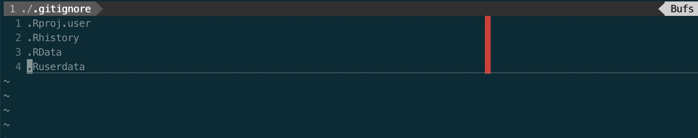

```{r setup, include=FALSE}
knitr::opts_chunk$set(echo = FALSE)
```

## Outline

### What is GCP?
- Google Big Query
- Google Cloud Storage


## Google Cloud Platform

{ width=90% }


## Google Big Query

Terminology 

- **Project** 
- **Dataset** 
- **Table**

{ width=50% }

_lions and tigers and bears, oh my!_


## `bigrquery` Package
- Authenticating
- Uploading
- Downloading
- Notebooks vs. html?

## Authenticating with `bigrquery`

{ width=100% }

{ width=100% }


## Creating & Uploading Tables

`bq_table()` - set up "bq_table" information
`bq_table_exists()` - checks to see if table exists, returns `TRUE` or `FALSE`
`bq_table_delete()` - deletes table

```{r, echo=TRUE}
library(bigrquery)
#Generate data
my_project <- "rational-photon-239401"
my_dataset <- "test_dataset"
my_table <- "iris"

#Set up BQ info
my_bq_table_info <- bq_table(project = my_project,
                             dataset = my_dataset,
                             table = my_table)

#If the table already exists, delete it, since we can't seem to append here
if (bq_table_exists(my_bq_table_info)){
  bq_table_delete(my_bq_table_info)
}
```

## Creating & Uploading Tables

`bq_table_create()` - Creates the table
`bq_table_upload()` - Uploads data; fields will create the schema from the dataframe
`as_bq_fields()` - Convert df schema information into BQ fields

```{r, echo=TRUE}
bq_table_create(my_bq_table_info)
bq_table_upload(x = my_bq_table_info,
                values = iris,
                fields = as_bq_fields(iris))

#Check if table exists
bq_table_exists(my_bq_table_info)
```


## Downloading Tables

`bq_project_query()` - Submits a query, waits for it to complete, and returns a "bq_table"
`bq_table_download()` - Retrieves rows in chunks of `page_size` from tb (a "bq_table") 

```{r cars, echo=TRUE, warning=FALSE, message=FALSE}
library(dplyr)
library(glue)

my_project <- "rational-photon-239401"
my_dataset <- "test_dataset"
my_table <- "iris"

sql <- glue("
    SELECT 
      * 
    FROM
      `{my_project}.{my_dataset}.{my_table}`
    ")

tb <- bq_project_query(my_project, sql)
bq_eg_df <- bq_table_download(tb)

bq_eg_df %>% head()

```

## `googleCloudStorageR` Package
- Authenticating
- Downloading
- Uploading
- Notebooks vs. html?
